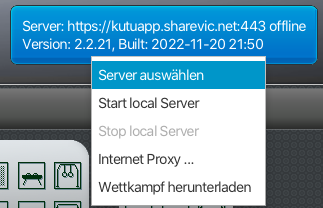
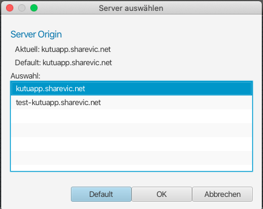

Einrichten einer Test-Installation
==================================

Zunächst muss die App ordentlich heruntergeladen und installiert werden.

Danach kann im Programm der Server ausgewählt werden. Die Einstellung wird nicht gespeichert.
Nach jedem Programmstart muss sie deshalb wenn nötig wieder eingestellt werden.

Die Einstellung erfolgt über ein PopUp-Menu auf dem blauen Status-Button oben rechts in der
Hauptansicht:

1. 
2. 

Sollte eine dedizierte Test-Installation eingerichtet werden, bei der die Einstellung nicht immer
wieder eingestellt werden muss, oder bei der andere Server-Adressen hinterlegt sein sollen, weil z.B. mit einem lokalen 
Entwicklungs-Server verbunden werden soll, kann mit folgender Anleitung eine Test-Instanz konfiguriert werden.

Die Versionsbezeichnungen können im Laufe geändert haben und müssen ggf. in den Scripts angepasst werden.
Aktuell wird -v2r3 verwendet.

Mac OS (Terminal):
------------------
Copy & Paste folgendes Script im Terminal, ev. mit `sudo` notwendig:
```
rm -rf ~/Applications/Test-KutuApp.app

cp -r /Applications/TurnerWettkampf-App-v2r3.app/ ~/Applications/Test-KutuApp.app

echo 'app {
  majorversion = "latest-testversion"
  remote {
    schema = "https"
    hostname = "test-kutuapp.sharevic.net"
  }
}' > ~/Applications/Test-KutuApp.app/Contents/app/kutuapp.conf

```
Dann starten mit:
```open -a Test-KutuApp```

Windows 10 (PowerShell):
------------------------

Menu start -> "PowerShell" eingeben, Windows PowerShell wählen:

Dann folgenden Inhalt einfügen:

```
function set-shortcut {
    param ( [string]$SourceLnk, [string]$DestinationPath )
    $WshShell = New-Object -comObject WScript.Shell
    $Shortcut = $WshShell.CreateShortcut($SourceLnk)
    $Shortcut.TargetPath = $DestinationPath
    $Shortcut.Save()
    }


$rmjob = Start-Job -ScriptBlock { rm $Env:LOCALAPPDATA\Test-TurnerWettkampf-App-v2r3 -Recurse }
Wait-Job $rmjob
Receive-Job $rmjob
$cpjob = Start-Job -ScriptBlock { cp $Env:LOCALAPPDATA\TurnerWettkampf-App-v2r3 $Env:LOCALAPPDATA\Test-TurnerWettkampf-App-v2r3 -Recurse }
Wait-Job $cpjob
Receive-Job $cpjob

Set-Content $Env:LOCALAPPDATA\Test-TurnerWettkampf-App-v2r3\app\kutuapp.conf -Value 'app {
  majorversion = "latest-testversion"
  remote {
    schema = "https"
    hostname = "test-kutuapp.sharevic.net"
  }
}'

$DesktopPath = [Environment]::GetFolderPath("Desktop")
set-shortcut "$DesktopPath\Test-TurnerWettkampf-App-v2r3.lnk" "$Env:LOCALAPPDATA\Test-TurnerWettkampf-App-v2r3\TurnerWettkampf-App-v2r3.exe"
```
Dann starten via Desktop-Verknüpfung oder via PowerShell mit
```
$Env:LOCALAPPDATA\Test-TurnerWettkampf-App-v2r3\TurnerWettkampf-App-v2r3.exe
```

Linux (Terminal):
-----------------

```
rm -rf ./TurnerWettkampf-App-v2r3

cp -r /opt/TurnerWettkampf-App-v2r3 ./

echo 'app {
  majorversion = "latest-testversion"
  remote {
    schema = "https"
    hostname = "test-kutuapp.sharevic.net"
  }
}' > TurnerWettkampf-App-v2r3/app/kutuapp.conf
```

Dann starten mit:
```~/TurnerWettkampf-App-v2r3/TurnerWettkampf-App-v2r3```


Verifikation, dass die Testversion korrekt funktioniert:
--------------------------------------------------------
Wenn die App nach dem Start oben rechts im blauen Feld die URL `"https://test-kutuapp.sharevic.net:443"` anzeigt, dann hat alles geklappt.
